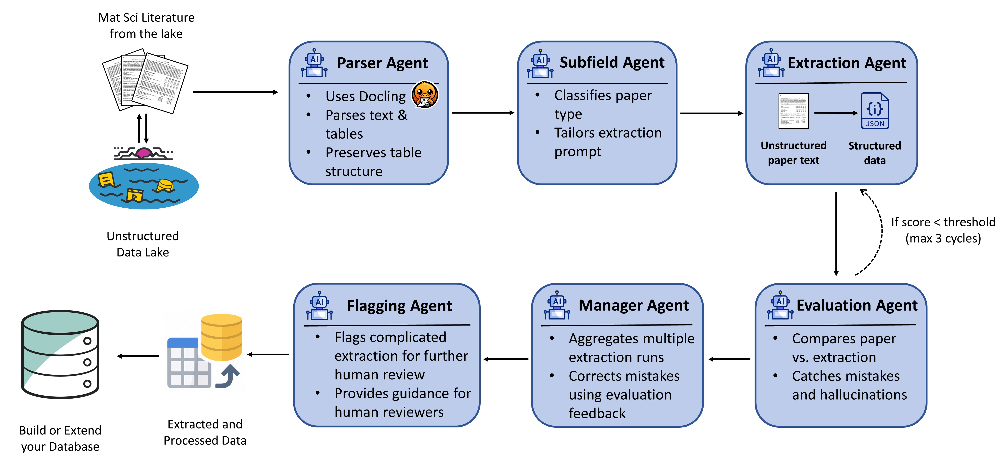

# KnowMat: Agentic Pipeline for Scientific Data Extraction



_KnowMat agentic pipeline for extracting structured data from scientific literature._

---

## Overview

KnowMat is an AI-driven, agentic pipeline that automatically extracts structured, machine-readable data from unstructured scientific documents (`.pdf` / `.txt`). Built on **LangGraph** with support for **OpenAI-compatible LLM APIs** (including ERNIE/Qianfan), it coordinates multiple intelligent agents to perform paper parsing, structured extraction, quality evaluation, and schema conversion.

### Core Capabilities

- **Research-grade batch processing**: Process entire directories of PDF/TXT files; supports **two-stage** workflow: run OCR only (`--ocr-only`) first, then batch LLM extraction
- **High accuracy**: Multi-agent architecture with up to 3 rounds of extraction/evaluation iteration
- **Dual-engine OCR**: PaddleOCR-VL 1.5 (layout + reading order) + PP-StructureV3 (complex tables & formulas); optional cloud API modes (`--paddleocr-api`, `--mineru-api`)
- **Figure interpretation**: Multimodal LLM generates textual descriptions of figures, injected into paper text before extraction
- **Formula & table enhancement**: Precise HTML table extraction and high-fidelity LaTeX formulas (auto-fixes chemical subscripts)
- **Two-stage validation**: Rule aggregation + LLM hallucination correction
- **Quality assurance**: Confidence scoring, human review flags & guidelines

---

## Installation

### Prerequisites

1. **Python 3.11**
2. **OpenAI-compatible LLM API Key** (e.g., ERNIE/Qianfan)
3. **LangChain API Key** (optional, for LangSmith tracing)

### Step 1: Clone the Repository

```bash
git clone https://github.com/shiyuasuka/ChemicalExtration.git
cd ChemicalExtration
```

### Step 2: Install Environment (Select Your Platform)

---

#### macOS (Recommended: pip)

macOS has no NVIDIA GPU, uses CPU mode.

```bash
# Create virtual environment
python -m venv venv
source venv/bin/activate

# Install project and dependencies
pip install -e .
pip install -r requirements.txt

# Download OCR models
python scripts/download_paddleocrvl_models.py --model-dir models/paddleocrvl1_5
```

---

#### Windows / Linux (Recommended: Conda)

**GPU mode (NVIDIA GPU):**

```bash
# Create and activate environment
conda env create -f environment.yml
conda activate KnowMat

# Install Paddle GPU dependencies
pip uninstall -y paddlepaddle paddlepaddle-gpu
pip install -r requirements-gpu.txt -i https://www.paddlepaddle.org.cn/packages/stable/cu129/
conda install nvidia::cudnn cuda-version=12 -y

# Download OCR models
python scripts/download_paddleocrvl_models.py --model-dir models/paddleocrvl1_5
```

**CPU mode (no NVIDIA GPU):**

```bash
# Create and activate environment
conda env create -f environment.yml
conda activate KnowMat

# Install Paddle CPU dependencies
pip install -r requirements.txt

# Download OCR models
python scripts/download_paddleocrvl_models.py --model-dir models/paddleocrvl1_5
```

---

### Step 3: Configure Environment Variables

```bash
cp .env.example .env
```

Edit `.env` with your API credentials:

```bash
# LLM API Configuration
LLM_API_KEY="your_llm_api_key"
LLM_BASE_URL="https://your-openai-compatible-endpoint.com/v2"
LLM_MODEL="your_model_name"

# PaddleOCR-VL Configuration
PADDLEOCRVL_MODEL_DIR=models/paddleocrvl1_5
PADDLEOCRVL_VERSION=1.5

# Optional: Cloud OCR APIs (no local GPU needed)
# MINERU_API_KEY="your_mineru_api_key"
# PADDLEOCR_API_TOKEN="your_paddleocr_api_token"
# PADDLEOCR_API_URL="https://aistudio.baidu.com/api/v1/paddleocr"

# Optional: LangSmith tracing
# LANGCHAIN_API_KEY="your_langchain_api_key"
# LANGCHAIN_TRACING_V2=false
```

**ERNIE/Qianfan Example:**

```bash
LLM_API_KEY="bce-v3/xxxx"
LLM_BASE_URL="https://qianfan.bj.baidubce.com/v2"
LLM_MODEL="ep_xxxxx"
```

### Step 4: Verify Installation

```bash
python -m knowmat --help
```

---

### Dependency Files Reference

| File | Purpose |
|------|---------|
| `environment.yml` | Conda full environment definition |
| `requirements.txt` | pip base dependencies |
| `requirements-gpu.txt` | GPU Paddle dependencies (NVIDIA) |
| `pyproject.toml` | Project metadata |

---

## Usage

### Two-Stage Workflow (Recommended for Large Batches)

**Stage 1: OCR only** (generates `.md` per PDF, no LLM calls):

```bash
python -m knowmat --input-folder data/raw --ocr-only
```

**Stage 2: LLM extraction** (reads `.md`, runs multi-agent pipeline):

```bash
python -m knowmat --input-folder data/raw --output-dir data/output --max-runs 2
```

### Single-Stage (OCR + Extraction in One Pass)

```bash
python -m knowmat --input-folder data/raw --output-dir data/output
```

### Cloud OCR API Modes

When you don't have a local GPU, use cloud APIs:

**PaddleOCR Cloud API** (PaddleOCR-VL-1.5 + PP-StructureV3 refinement):

```bash
python -m knowmat --input-folder data/raw --paddleocr-api --ocr-only
```

**MinerU Cloud API** (high-precision document parsing):

```bash
python -m knowmat --input-folder data/raw --mineru-api --ocr-only
```

### Python API

```python
from knowmat.orchestrator import run

result = run(
    pdf_path="data/raw/paper.md",
    output_dir="data/output",
    max_runs=2,
)
```

---

## Figure Interpretation

KnowMat uses a multimodal LLM to generate textual descriptions of figures found in papers. This enriches the paper text before extraction, enabling the LLM to "see" figure content.

**How it works:**
1. During OCR, figure images are cropped from PDF pages and saved to a `figures/` directory
2. A vision-capable LLM generates 2-4 sentence descriptions for each figure
3. Descriptions are injected into the paper text as blockquotes above the figure caption

**Configuration:**
- Enabled by default (`KNOWMAT2_FIGURE_DESCRIPTION_ENABLED=1`)
- Disable: `KNOWMAT2_FIGURE_DESCRIPTION_ENABLED=0`
- Requires `LLM_MODEL` to support vision/multimodal inputs

---

## Configuration

### Environment Variables

| Variable | Description | Default |
|----------|-------------|---------|
| `LLM_API_KEY` | LLM API key (required) | — |
| `LLM_BASE_URL` | OpenAI-compatible API base URL | — |
| `LLM_MODEL` | Model name or endpoint ID | `gpt-5` |
| `PADDLEOCRVL_MODEL_DIR` | Path to OCR models | `models/paddleocrvl1_5` |
| `PADDLEOCRVL_VERSION` | OCR model version (`1.0` or `1.5`) | `1.5` |
| `KNOWMAT2_FIGURE_DESCRIPTION_ENABLED` | Enable figure AI description | `1` |
| `KNOWMAT2_TRIM_REFERENCES_SECTION` | Trim content after References | `false` |
| `KNOWMAT2_INPUT_DIR` | Default input directory | `data/raw` |
| `KNOWMAT2_OUTPUT_DIR` | Default output directory | `data/output` |
| `MINERU_API_KEY` | MinerU cloud API key (for `--mineru-api`) | — |
| `PADDLEOCR_API_TOKEN` | PaddleOCR cloud API token (for `--paddleocr-api`) | — |
| `PADDLEOCR_API_URL` | PaddleOCR API endpoint URL | — |
| `PADDLEOCR_API_TIMEOUT_SEC` | API request timeout | `600` |
| `KNOWMAT_OCR_DEVICE` | OCR device (`gpu:0` or `cpu`) | auto |
| `LANGCHAIN_API_KEY` | LangSmith tracing key (optional) | — |

### Per-Agent Model Overrides

Override models for individual agents via CLI or env vars:

```bash
python -m knowmat --input-folder data/raw \
    --extraction-model ep_extraction \
    --evaluation-model ep_eval \
    --flagging-model ep_flag
```

Or via environment: `KNOWMAT2_EXTRACTION_MODEL`, `KNOWMAT2_EVALUATION_MODEL`, etc.

---

## Output Structure

**Input directory** (e.g., `data/raw/`) — PDF files and OCR intermediates:

```
data/raw/
├── paper.pdf
└── paper/
    ├── paper.md              # OCR output (markdown)
    ├── paper.json            # OCR structured items
    └── images/               # Cropped figure images
```

**Output directory** (e.g., `data/output/`) — extraction results:

```
data/output/
└── paper/
    ├── paper_extraction.json       # Final structured extraction
    ├── paper_analysis_report.txt   # Human-readable report
    ├── paper_runs.json             # Per-run extraction details
    └── paper_qa_report.json        # Quality & review flags
```

---

## Project Structure

```
src/knowmat/
├── __main__.py              # CLI entry point
├── app_config.py            # Pydantic settings (KNOWMAT2_* env prefix)
├── config.py                # Low-level .env loading & API key setup
├── env_loader.py            # .env discovery, validation, loading
├── orchestrator.py          # LangGraph workflow assembly
├── states.py                # Shared TypedDict state
├── schema_converter.py      # Raw extraction → target schema
├── domain_rules.py          # Domain-specific validation rules
├── extractors.py            # Extraction helpers
├── nodes/                   # Pipeline nodes
│   ├── paddleocrvl_parse_pdf.py  # PDF→text (OCR dispatch)
│   ├── extraction.py             # TrustCall-based extraction
│   ├── aggregator.py             # Multi-run aggregation
│   ├── validator.py              # LLM hallucination correction
│   └── flagging.py               # Quality assessment
└── pdf/                     # OCR & figure sub-package
    ├── ocr_engine.py             # Local PaddleOCR-VL management
    ├── mineru_api_client.py      # MinerU cloud API client
    ├── mineru_result_converter.py
    ├── paddleocr_api_client.py   # PaddleOCR cloud API client
    ├── paddleocr_api_result_converter.py
    ├── figure_describer.py       # Multimodal LLM figure description
    ├── figure_items.py           # Figure OCR item normalization
    └── ...
```

---

## Troubleshooting

### Common Issues

| Problem | Solution |
|---------|----------|
| `LLM_API_KEY not set` | Add API key to `.env` file |
| `Invalid .env file` | Fix unclosed quotes (env_loader validates syntax) |
| `--mineru-api` fails | Ensure `MINERU_API_KEY` is set in `.env` |
| `--paddleocr-api` fails | Ensure `PADDLEOCR_API_TOKEN` is set in `.env` |
| GPU OOM during OCR | Reduce `--ocr-workers` to 1, or use cloud API mode |
| `cudnn64_9.dll` not found | See [docs/ocr-cudnn64_9-fix.md](docs/ocr-cudnn64_9-fix.md) |

---

## Citation

If you use KnowMat in your research, please cite:

```bibtex
@software{knowmat2024,
  title={KnowMat: Agentic Pipeline for Scientific Data Extraction},
  author={KnowMat Team},
  year={2024},
  url={https://github.com/shiyuasuka/ChemicalExtration}
}
```

---

## Contributing

Contributions are welcome! Please open an issue or pull request.

## License

MIT License
